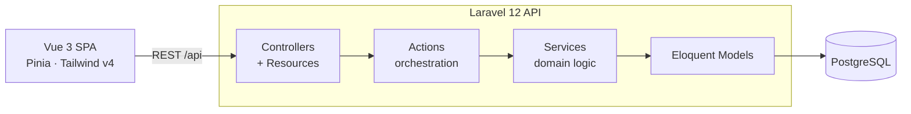

# Champions League Simulation

> A football league simulator with double round-robin scheduling, a strength-based
> match engine, live standings, and Monte Carlo title prediction — served by a
> Laravel REST API and a polished Vue 3 dashboard.

[**▶ Watch the demo**](#demo) · [Features](#features) · [Screenshots](#screenshots) · [Architecture](#architecture) · [Local setup](#local-setup)

---

## Features

- **League simulation** — run a full season for four teams from a clean slate.
- **Double round-robin fixtures** — 12 matches across 6 weeks, each pair home and away.
- **Match simulation engine** — results driven by team strength, home advantage, and controlled randomness.
- **Live standings** — points, goal difference, and tiebreakers recomputed from played fixtures.
- **Monte Carlo championship prediction** — thousands of simulated seasons estimate each team's title chance.
- **REST API** — clean JSON endpoints with meaningful status codes.
- **Vue dashboard** — responsive, dark, premium analytics UI with toasts, skeletons, and transitions.
- **Laravel backend** — service/action layered architecture with full test coverage.

---

## Demo

<p align="center">
  
</p>

Open the dashboard → generate fixtures → play weeks → predictions unlock → play all → champion crowned.

---

## Screenshots

| Dashboard | Fixtures generated |
| --- | --- |
|  |  |

| Week played | Championship prediction |
| --- | --- |
|  |  |

| Play all (confirm) | Final table |
| --- | --- |
|  |  |

| Champion |
| --- |
|  |

---

## Architecture



Controllers stay thin and translate domain exceptions to HTTP status codes. Actions
orchestrate multi-step flows (play week / next / all) over the services. Services hold
the football logic — fixture generation, simulation, standings, and prediction — and
return immutable value objects. Eloquent persists only raw facts; nothing derived is
stored.

---

## Tech Stack

**Backend**

- Laravel 12
- PHP 8.3
- PostgreSQL

**Frontend**

- Vue 3
- TypeScript
- Pinia
- Tailwind CSS v4
- Vite

**Quality**

- PHPUnit
- PHPStan (Larastan, level 6)
- Laravel Pint
- ESLint

**Infrastructure**

- Docker Compose
- Nginx

---

## Local setup

**Backend**

```bash
cd backend
composer install
cp .env.example .env
php artisan key:generate
php artisan migrate:fresh --seed
php artisan serve
```

**Frontend**

```bash
cd frontend
npm install
cp .env.example .env
npm run dev
```

The dashboard runs at `http://localhost:5173` and calls the API at
`http://127.0.0.1:8000` (configurable via `VITE_API_URL`).

> Prefer containers? `docker compose up --build` starts PostgreSQL, the API, Nginx, and the frontend.

---

## Testing

**Backend**

```bash
php artisan test
./vendor/bin/phpstan analyse
./vendor/bin/pint --test
```

**Frontend**

```bash
npm run lint
npm run type-check
npm run build
```

---

## Project structure

```
champions-league/
├── backend/                       # Laravel 12 API
│   ├── app/
│   │   ├── Actions/               # PlayWeek / PlayNextWeek / PlayAllRemaining
│   │   ├── Exceptions/            # Domain exceptions (HTTP-status aware)
│   │   ├── Http/
│   │   │   ├── Controllers/Api/   # LeagueController
│   │   │   └── Resources/         # Team / Fixture / Standing / Prediction
│   │   ├── Models/                # Team, Fixture
│   │   └── Services/              # Fixtures, Simulation, Standings, Prediction
│   ├── routes/api.php
│   └── tests/Feature/             # PHPUnit feature tests
├── frontend/                      # Vue 3 + TypeScript SPA
│   └── src/
│       ├── components/            # Dashboard UI components
│       ├── services/              # HTTP client + typed API
│       ├── stores/                # Pinia (league, toasts)
│       ├── types/                 # API response types
│       └── views/HomeView.vue
├── docker/                        # Dockerfiles + Nginx config
├── docs/                          # Architecture, API, screenshots, demo
└── docker-compose.yml
```

---

## Design decisions

**Service layer** — All football logic lives in single-responsibility services
(`FixtureGenerationService`, `MatchSimulationService`, `LeagueStandingsService`,
`ChampionshipPredictionService`). Controllers and actions never contain business rules,
which keeps the domain testable in isolation and reusable across the API and CLI.

**Actions** — Multi-step flows are modelled as thin, composable actions
(`PlayWeekAction`, `PlayNextWeekAction`, `PlayAllRemainingFixturesAction`). They
orchestrate the simulation service and enforce flow rules (valid week, already played,
league complete) without duplicating simulation logic.

**Immutable value objects** — Standings and predictions are returned as readonly value
objects (`TeamStanding`, `ChampionChance`, `MatchResult`) rather than mutated arrays. A
separate mutable `TeamTally` accumulates during calculation, so results are computed on
the fly and never persisted, keeping the database the single source of raw truth.

**Monte Carlo prediction** — Championship odds come from simulating the remaining
fixtures many times (default 1000) using the same scoring logic as live matches, then
counting how often each team finishes first. Randomness is injected, so tests run with a
seeded engine for stable, deterministic assertions.

**Deterministic fixture generation** — The schedule is built with the circle method, so
the same teams always yield the same fixtures. Generation refuses to run twice, giving a
predictable starting point for both gameplay and tests.

---

## Future improvements

- Authentication and per-user leagues
- Multiple seasons and historical records
- Team management (create, edit, rename)
- Player transfers affecting team strength
- REST pagination and filtering
- CI/CD pipeline with automated deployment

---

## License

Released under the [MIT License](LICENSE).
